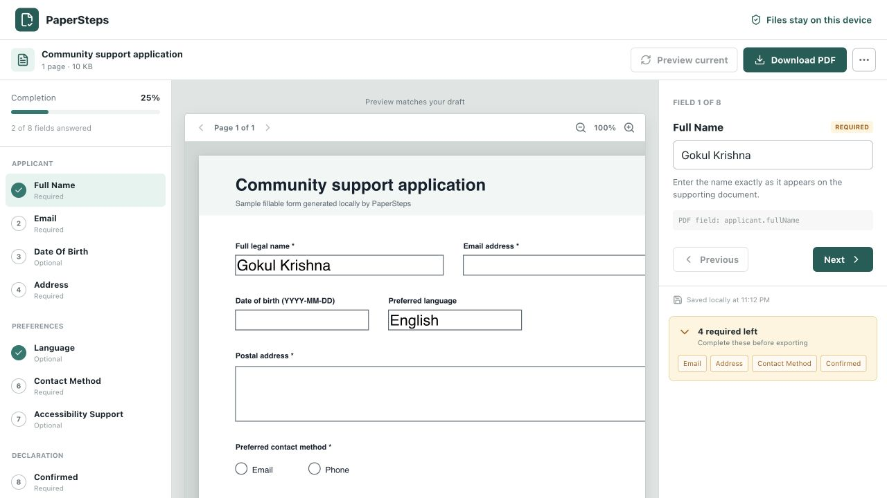
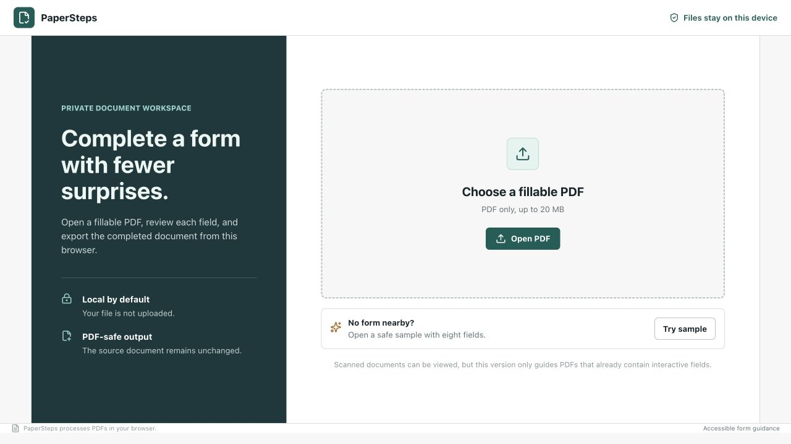
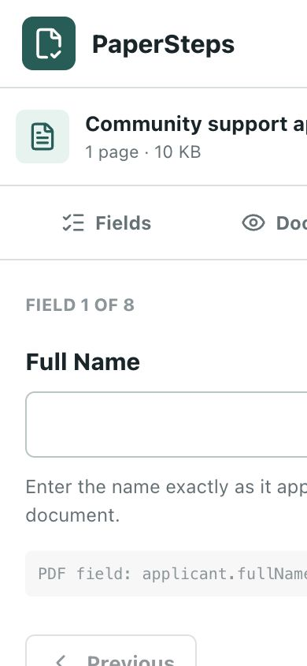

# PaperSteps

PaperSteps is a local-first, accessible workspace for completing fillable PDF forms. It turns the interactive fields already embedded in a PDF into a guided workflow, validates required answers, and exports a new completed document without modifying the source file.

**Live application:** [gokul-debugger.github.io/papersteps](https://gokul-debugger.github.io/papersteps/)



## Why PaperSteps

Forms can be visually and cognitively difficult to complete. Clear labels, instructions, grouping, validation, and predictable navigation help everyone, particularly people using assistive technology or working through unfamiliar paperwork.

PaperSteps explores how those accessibility practices can be added around an existing PDF while keeping personal documents on the user's device.

## Current Capabilities

- Open fillable PDFs up to 20 MB
- Detect text fields, checkboxes, radio groups, dropdowns, and option lists
- Group fields using their PDF identifiers
- Identify required and read-only fields
- Navigate one field at a time with plain-language prompts
- Track completion and missing required answers
- Save draft values in browser storage
- Render PDFs consistently with Mozilla PDF.js
- Regenerate a preview containing current answers
- Download a new completed PDF
- Export entered field data as JSON
- Use a generated eight-field sample without downloading test data

The PDF bytes never leave the browser in the current application. PaperSteps has no backend, account system, analytics, or remote file storage.

## Supported Scope

PaperSteps currently works with PDFs containing interactive AcroForm fields. A document without interactive fields can be viewed, but it cannot be converted into a guided form yet.

Not currently supported:

- OCR for scanned forms
- XFA forms
- Cryptographic signatures
- Automatic form submission
- Legal, financial, medical, or eligibility advice
- Automatic interpretation of unclear official instructions

These boundaries are intentional. PaperSteps should not imply certainty about instructions it cannot verify.

## Screens

| Intake | Mobile completion |
|---|---|
|  |  |

## Technology

- React 19 and TypeScript
- Vite
- `pdf-lib` for form inspection and completed-PDF generation
- Mozilla PDF.js for canvas rendering
- Lucide icons
- Vitest for unit and PDF round-trip tests
- Playwright for desktop and mobile workflow tests
- Oxlint

PDF libraries are loaded only after a document or sample is opened, keeping the initial application bundle smaller.

## Run Locally

Requirements:

- Node.js 20 or newer
- npm 10 or newer

```bash
git clone https://github.com/gokul-debugger/papersteps.git
cd papersteps
npm install
npm run dev
```

Open the local URL printed by Vite, then select **Try sample** or open a fillable PDF.

## Quality Checks

```bash
npm run lint
npm run test
npm run build
npm run test:e2e
```

The PDF tests create a form in memory, inspect its fields, write representative answers, reopen the generated PDF, and verify that the values survived the round trip. Playwright also completes the sample workflow in desktop Chrome and a mobile-sized Chrome viewport.

## Architecture

```text
src/
├── components/
│   ├── AppHeader.tsx
│   ├── DocumentWorkspace.tsx
│   ├── FieldEditor.tsx
│   ├── PdfPreview.tsx
│   └── UploadPanel.tsx
├── lib/
│   ├── fields.ts
│   ├── pdf.ts
│   └── storage.ts
├── test/
│   └── setup.ts
├── App.tsx
└── types.ts

e2e/
└── papersteps.spec.ts
```

The application separates document parsing, field guidance, browser persistence, and interface state. PDF exports always begin from the original in-memory bytes, so preview updates do not repeatedly rewrite an already modified file.

## Privacy Model

- Files are read through browser APIs.
- Source PDF bytes remain in memory for the current session.
- Draft field values are stored in `localStorage`, keyed by a shortened SHA-256 document fingerprint.
- Drafts contain entered values and the file name, but not the PDF itself.
- Closing the browser tab releases in-memory PDF data.
- **Clear local draft** removes saved field values for the open document.

See [SECURITY.md](SECURITY.md) for reporting and handling expectations.

## Roadmap

1. Accessible field overrides supplied by reviewed form templates
2. Field-format validation and date controls
3. Optional IndexedDB document restoration with explicit consent
4. Screen-reader and keyboard-navigation audits
5. Offline-capable progressive web application packaging
6. Carefully scoped OCR research for scanned forms
7. Community translations for the PaperSteps interface

## Contributing

Contributions are welcome. Start with [CONTRIBUTING.md](CONTRIBUTING.md), which lists safe contribution areas and the checks required before a pull request.

## License

PaperSteps is available under the [MIT License](LICENSE).

## Author

Gokul Krishna  
GitHub: [gokul-debugger](https://github.com/gokul-debugger)
